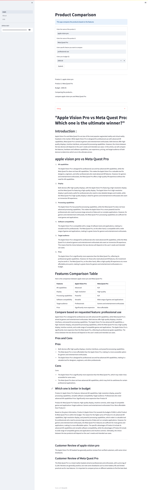

# Project
[](https://radstalst-productcompareai-main-qbamny.streamlit.app/)

## Description

## Requirements
1. Python 3.10
2. OpenAI API key to be entered in the web

## Run
```bash
streamlit run main.py
```
## Demo
[link to our demo on streamlit](https://radstalst-productcompareai-main-qbamny.streamlit.app/)
## Features
- [X] introductory paragraph
- [X] vs paragraphs based on comparison table
- [X] Comparison Table
- [ ] ~~Which one to pick based on~~ 
  - [ ] ~~performance~~
  - [ ] ~~budget~~
- [X] Pros and Cons
- [X] Conclusion

## Example of the running app


